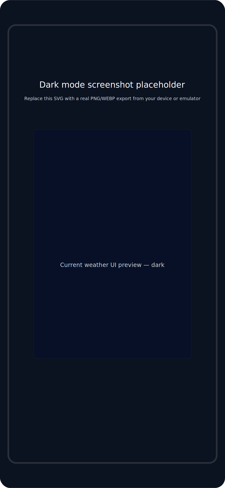

# Weather (Android)

A small Android app that displays current weather, hourly and daily forecasts for the user's current location. Built with Jetpack Compose and following a Clean Architecture + MVVM structure.

## Highlights

- Single-screen Compose UI showing:
  - Current conditions (temperature, weather description, icon)
  - Hourly forecast
  - Daily forecast
  - Details cards (humidity, pressure, wind, UV index, etc.)
- Clean architecture (domain, data, presentation layers)
- MVVM with a Compose-friendly ViewModel
- Koin for dependency injection
- Ktor HTTP client + kotlinx.serialization for networking
- Uses Google Play Services Fused Location to obtain the device location
- Uses Open-Meteo (https://open-meteo.com) for weather data and OpenStreetMap Nominatim for reverse geocoding (no API key required)

## Project structure

- `app/src/main/java/com/thechance.weather`
  - `data` — remote data sources (Ktor clients), local (fused) location provider, mappers
  - `domain` — models, repository interfaces, use cases, domain exceptions
  - `presentation` — Compose UI, ViewModels, UI models and themes
  - `di` — Koin modules wiring the app together
  - `WeatherApplication` — Koin initialization

## Key libraries & versions (from project)

- Android Gradle Plugin: 8.10.1
- Kotlin: 2.0.21
- Jetpack Compose (BOM): 2024.09.00
- Ktor client: 3.1.3
- Koin: 4.0.4
- Google Play Services Location
- kotlinx.serialization / kotlinx.coroutines

(See `gradle/libs.versions.toml` and `app/build.gradle.kts` for full details.)

## Permissions

The app requires the following runtime permissions:

- `ACCESS_FINE_LOCATION` / `ACCESS_COARSE_LOCATION` — to fetch device location via FusedLocationProvider
- `INTERNET` — to call the remote APIs

The `AndroidManifest.xml` already declares these permissions. The app's UI / ViewModel maps permission and location errors to friendly messages.

## External APIs

- Weather: Open-Meteo (https://api.open-meteo.com/v1) — used by `WeatherRemoteDataSourceImpl`. Open-Meteo is free and does not require an API key.
- Reverse Geocoding: Nominatim (https://nominatim.openstreetmap.org) — used by `GeocodingRemoteDataSourceImpl` to obtain a city name. No API key needed, but please respect usage policy for heavy traffic.

No API keys or secret configuration are required to run the app.

## How it works (brief)

- On start, `WeatherViewModel` triggers `loadWeather()`.
- `GetCurrentLocationUseCase` retrieves the location from `LocationRepository` which uses Google Play Services (FusedLocationDataSource).
- `GetWeatherUseCase` calls the `WeatherRepository` which uses a Ktor client to fetch weather data from Open-Meteo.
- `GetCityNameUseCase` calls Nominatim to resolve a readable city name for display.
- The domain objects are mapped to UI state models via `presentation.mapper` and rendered using Jetpack Compose.

## Running locally

Requirements:

- Android Studio Flamingo or newer (recommended)
- Android SDK configured for API level 36 (compileSdk 36)
- Device or emulator with Google Play services for Fused Location

Steps:

1. Open the project in Android Studio.
2. Let Gradle sync and download dependencies.
3. Build and run on an emulator or device (API 26+).

Note: The app uses Google Play Services for location. Use an emulator image that includes Google Play, or test on a real device.

## Testing

- Unit tests: see `app/src/test` (simple sample unit test included).
- UI / Instrumentation: can be added under `androidTest`.

## Error handling

Common errors are mapped to user-facing messages in `WeatherViewModel.mapErrorToMessage()`:
- Location permission issues
- GPS disabled
- Network / server errors
- Data parsing issues

## Contributing

Small, focused PRs are welcome. Suggested improvements:
- Add customizable settings (units: metric/imperial, refresh interval)
- Add caching / offline support
- Add more robust permission & location flow (rationale, in-app settings)
- Add tests for repository and ViewModel logic

## Notes and assumptions

- The app expects the device to grant location permissions at runtime. There is no in-repo secret or API key.
- Open-Meteo and Nominatim have rate limits and usage policies; for production apps, consider using an API key-backed service or a caching/proxy layer.

## License

Specify your license here (e.g., MIT) or add a `LICENSE` file.

---

If you'd like, I can:
- Add a short GIF or screenshots of the app to the README
- Add instructions to run on CI or instrumented tests
- Add a settings screen with unit selection

Tell me which of those you'd like next.

## Screenshots & Demo placeholders

I added placeholder assets you can replace with real screenshots and short demo videos. These help when publishing the repo or writing documentation.

Placeholders (already added under `assets/`):

- `assets/screenshots/light_mode_screenshot.svg` — light theme full-screen screenshot placeholder
- `assets/screenshots/dark_mode_screenshot.svg` — dark theme full-screen screenshot placeholder
- `assets/videos/light_mode_thumbnail.svg` — light theme demo thumbnail placeholder (replace with `assets/videos/demo_light.mp4` or GIF)
- `assets/videos/dark_mode_thumbnail.svg` — dark theme demo thumbnail placeholder (replace with `assets/videos/demo_dark.mp4` or GIF)

How to replace:

1. Capture screenshots from an emulator or device (export PNG or WEBP). Recommended sizes: 1080x2340 (phone) or match your device resolution.
2. Place them in `assets/screenshots/` and name them `screenshot_light.png` / `screenshot_dark.png`, or update the README references to your filenames.
3. For demo video/GIFs, add `demo_light.mp4` and `demo_dark.mp4` under `assets/videos/` or replace the thumbnail SVGs with your GIFs.

Markdown example to embed images in this README:

```markdown



[](assets/videos/demo_light.mp4)
```

Notes:

- SVG placeholders are lightweight and safe to commit. Replace them with exported PNG/WEBP for higher-fidelity screenshots.
- For GitHub, large videos are not recommended in the repo; consider hosting demo videos externally (YouTube, GitHub Releases, or an S3 bucket) and linking from the README.

If you want, I can:
- Add the actual Markdown preview with the images embedded at the top of the README
- Generate a small script to capture emulator screenshots with `adb` and save them into `assets/screenshots/`
- Provide a recommended GIF/MP4 encoding command (ffmpeg) to produce optimized demo files

Tell me which you'd like next.